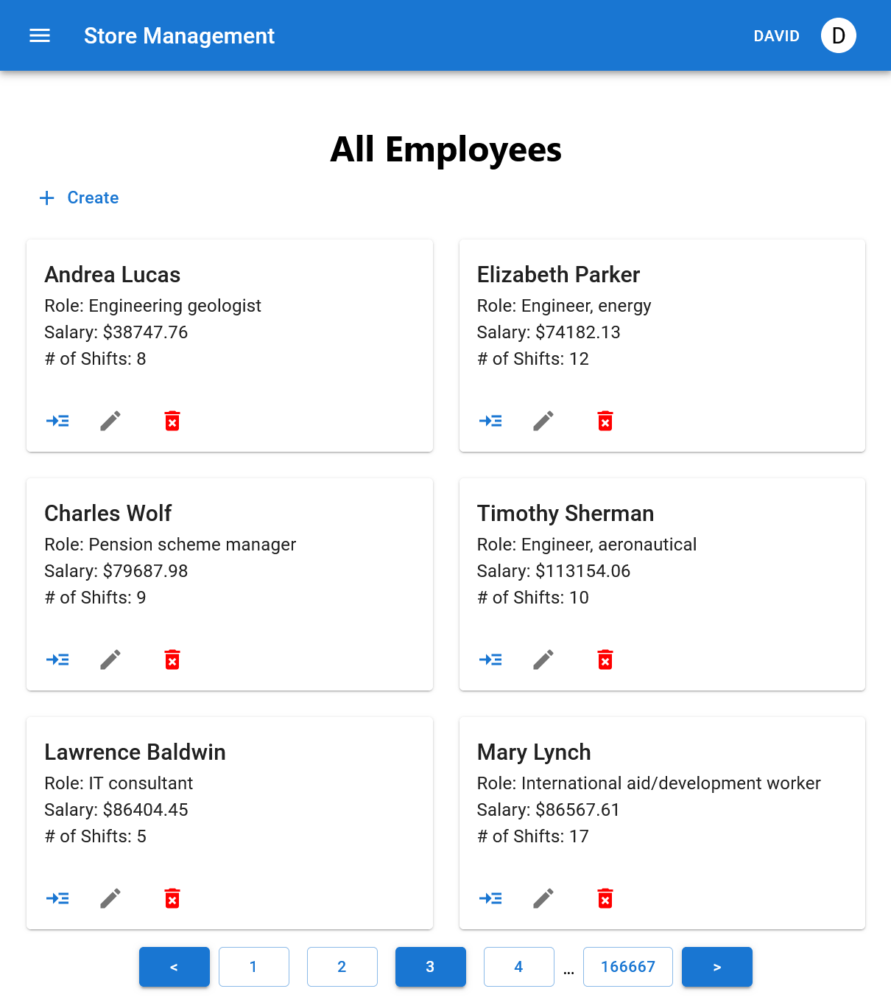

# Store Management

## Description

This project showcases a full-stack application with CRUD functionalities, entity relationships, a RESTful API, and advanced features like user authentication, role-based access, statistical reporting, and more.

## Technologies

- Backend: C# .NET 7 with Entity Framework
- Database: MS SQL Server 2022
- Frontend: React with Vite and Material UI
- Deployment: Docker and Kubernetes

## Features

- CRUD operations for multiple entities
- Complex entity relationships including one-to-many and many-to-many
- REST API with Swagger documentation
- User authentication and role-based authorization
- Statistical reports and real-time data updates
- Responsive SPA frontend
- High scalability and performance optimization

See the [REQUIREMETS.md](./REQUIREMENTS.md) file for more details.

## Getting Started

### Prerequisites

- Docker
- Node.js

### Development Setup

1. Clone the repository:

```bash
git clone https://github.com/davidcristian/Store-Management-React-.NET.git
```

2. Navigate to the DevOps/Docker directory and start the containers:

```
docker-compose up --build
```

3. Navigate to the StoreManagement directory and install the dependencies:

```bash
npm install
```

4. Start the frontend development server:

```bash
npm run dev
```

## Usage

The Swagger API documentation page can be accessed at `http://localhost:5000` after deployment. Use it to interact with the API, or try the React frontend for a user-friendly interface at the port opened by Vite.

## Preview



## License

This project is licensed under the GNU General Public License v3.0 - see the [LICENSE](./LICENSE) file for details.
